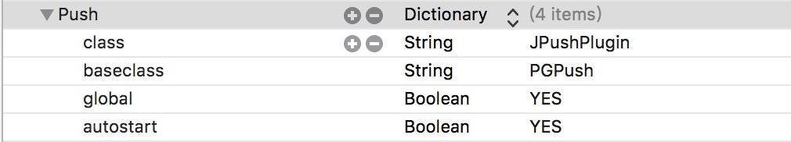

# JPush HBuilder Demo

[](https://github.com/jpush/jpush-hbuilder-demo)
[](http://weibo.com/jpush?refer_flag=1001030101_&is_all=1)

[极光推送](https://www.jiguangh.cn/) 官方提供的 JPush HBuilder Demo。是基于 HBuilder 提供的 [第三方插件架构](http://ask.dcloud.net.cn/docs/#http://ask.dcloud.net.cn/article/66) 进而开发出的推送插件，并集成到 iOS/Android 工程里的 demo。开发者可以通过我们提供的[安装方式](#install)将推送功能集成到自己的项目中，从而在 js 层实现对推送的控制。

可以将 Demo 直接导入 Android Studio 或 Xcode 运行，如果想要在自己的项目中集成 JPush，可以参考以下步骤：

### Android

#### Demo 用法

通过 Android Studio 引入项目目录下的 android 目录，再替换 ./android/app/build.gradle 中的「应用的包名」和「应用的 AppKey」。

#### 集成指南

HBuilder 项目集成第三方插件，需先参考 HBuilder 官方的[离线打包](https://ask.dcloud.net.cn/article/924)教程，将您的 HBuilder 项目集成进 Android 工程中。之后再执行以下步骤：
1. 拷贝 `./android/app/src/main/java/io.dcloud.feature.jpush` 文件夹至你 Android Studio 工程的 `/src/main/java/` 目录下。
2. 拷贝 `./jpush.js` 到你 Android Studio 工程的 `/assets/apps/HBuilder应用名/js/` 下。
3. 在 `/assets/apps/你的应用名/www/manifest.json` 文件中添加：

    ```json
    "Push": {
        "description": "消息推送"
    }
    ```

4. 在 `/assets/data/dcloud_properties.xml` 中添加（如果已存在 Push feature

    ```xml
    <feature
        name="Push"
        value="io.dcloud.feature.jpush.JPushService" >
    </feature>
    ```

5. 在 `app/build.gradle` 中添加：

    ```groovy
    android {
        ...
        defaultConfig {
            applicationId "com.xxx.xxx" // JPush 上注册的包名.
            ...
            ndk {
                // 选择要添加的对应 cpu 类型的 .so 库。
                abiFilters 'armeabi', 'armeabi-v7a', 'arm64-v8a'
                // 还可以添加 'x86', 'x86_64', 'mips', 'mips64'
            }
            manifestPlaceholders = [
                JPUSH_PKGNAME : applicationId,
                JPUSH_APPKEY : "应用的 AppKey", // JPush上注册的包名对应的 appkey
                JPUSH_CHANNEL : "developer-default", // 暂时填写默认值即可
            ]
            ...
        }
        ...
    }
    dependencies {
        ...
        compile 'cn.jiguang.sdk:jpush:3.1.1'  // 此处以 JPush 3.1.1 版本为例。
        compile 'cn.jiguang.sdk:jcore:1.1.9'  // 此处以 JCore 1.1.9 版本为例。
        ...
    }
    ```

6. 在 `AndroidManifest.xml` 中添加：

    ```xml
    <receiver
      android:name="io.dcloud.feature.jpush.JPushReceiver"
      android:enabled="true"
      android:exported="false">
        <intent-filter>
          <action android:name="cn.jpush.android.intent.REGISTRATION" /> <!-- Required 用户注册SDK的 intent -->
          <action android:name="cn.jpush.android.intent.UNREGISTRATION" />
          <action android:name="cn.jpush.android.intent.MESSAGE_RECEIVED" /> <!-- Required 用户接收SDK消息的 intent -->
          <action android:name="cn.jpush.android.intent.NOTIFICATION_RECEIVED" /> <!-- Required 用户接收SDK通知栏信息的 intent -->
          <action android:name="cn.jpush.android.intent.NOTIFICATION_OPENED" /> <!-- Required 用户打开自定义通知栏的 intent -->
          <action android:name="cn.jpush.android.intent.ACTION_RICHPUSH_CALLBACK" /> <!-- Optional 用户接受 Rich Push Javascript 回调函数的intent -->
          <action android:name="cn.jpush.android.intent.CONNECTION" /> <!-- 接收网络变化 连接/断开 since 1.6.3 -->
          <category android:name="${JPUSH_PKGNAME}" />
        </intent-filter>
    </receiver>
    ```

### iOS 手动安装
- 配置 manifest.json ，首先用源码的方式打开工程 /Pandora/ 目录下的 manifest.json ，在"permissions"中添加新的插件名称：

        "permissions": {
            "Push": {
        		"description": "极光推送插件"
        	}
        }

- 配置 feature.plist ，在 Xcode 中打开 ../PandoraApi.bundle/ 目录下的 feature.plist ，为插件添加新的 item：

 

- 将 JPush_Support 文件夹中所有内容在 Xcode 中拖到自己的工程里

- 在 JPush_Support/PushConfig.plist 中配置 APP_KEY 、 PRODUCTION（0开发 / 1发布）、IDFA（是否需要通过广告标识符启动 sdk）

- 打开 xcode，点击工程目录中顶部的 工程，选择(Target -> Build Phases -> Link Binary With Libraries)，添加以下框架：

   CFNetwork.framework
   	CoreFoundation.framework
   	CoreTelephony.framework
   	SystemConfiguration.framework
   	CoreGraphics.framework
   	Foundation.framework
   	UIKit.framework
   	AdSupport.framework
    libresolv.tbd(若存在 libresolv.dylib 则替换为 libresolv.tbd)
   	libz.tbd(若存在 libz.dylib 则替换为 libz.tbd)

## API 说明

iOS、Android 详细 API 文档请参阅 [JPush Hbuilder API 文档](API.md)。

插件的 API 集中在 jpush.js 文件中，该文件的具体位置如下：

Android:

```
[Project]/android/assets/apps/H51423BFB/www/js/jpush.js
```

iOS:

```
  [Project]/iOS/HBuilder-Hello_jpush/HBuilder-Hello/Pandora/apps/HelloH5/www/js/jpush.js
```

## 常见问题

### iOS

1. 提示 Not get deviceToken yet。

   找到 Project -> TARGETS ->Capabilities -> Push Notifications 点开推送选项。

1. 新版本中 H5P deviceToken 的获取回调已经不回调给 `PGPush`了。因此需要需要在 Appdelegate.m 文件中的 `didRegisterForRemoteNotificationsWithDeviceToken` 方法中添加代码：`[JPUSHService registerDeviceToken:deviceToken];` ，注意导入头文件 `import "JPUSHService.h"`。

1. 新版本 H5P 官方已经把 PGPush 移除，所以需要将 demo 中的 `PGPush.h` 添加到自己工程。

1. 收不到推送：首先按照正确方式再次配置证书、描述文件：[iOS 证书设置指南](http://docs.jpush.io/client/ios_tutorials/#ios_1)。

1. PushConfig.plist 中的属性：
    - APP_KEY：应用标识
    - CHANNEL：渠道标识
    - IsProduction：是否生产环境
    - IsIDFA：是否使用 IDFA 启动 sdk

### 更多

 [JPush 官网文档](http://docs.jiguang.cn/)
